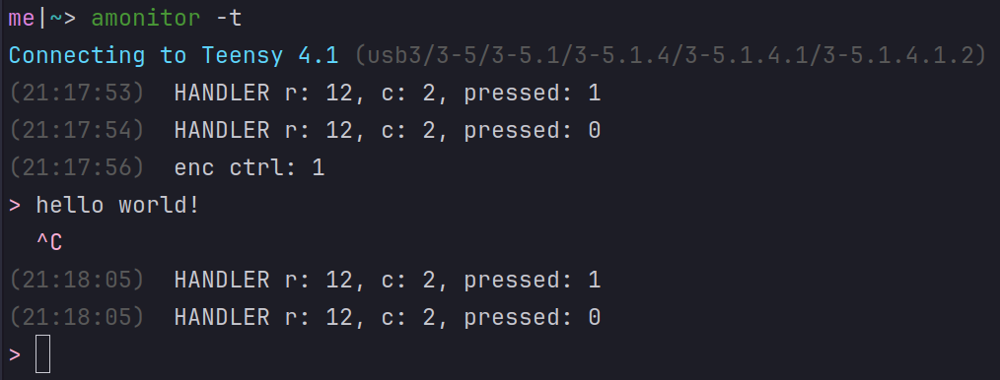

# amonitor - pretty arduino serial monitor



amonitor is a command-line serial monitor that works especially nicely with arduino boards. it looks nice (at least in my opinion!) and has quality-of-life features like input history, timestamps, automatic detection and reconnection, etc.

## installation

amonitor depends on the arduino CLI, so make sure you have that first.

then, run
```shell
git clone --recurse-submodules https://github.com/merlin04/amonitor
cd amonitor
opam install . --deps-only
# then whatever opam tells you to do
dune build
dune install
```